### 클래스 다이어그램

```mermaid
classDiagram
    %% Annotation
    class ErrorMonitor {
        <<annotation>>
        +String severity() "ERROR"
    }

    %% Agent Entry Point
    class ErrorMonitorAgent {
        +static void premain(String agentArgs, Instrumentation inst)
    }

    %% Core Transformer
    class ErrorMonitorTransformer {
        <<implements ClassFileTransformer>>
        +byte[] transform(ClassLoader loader, String className, Class classBeingRedefined, ProtectionDomain protectionDomain, byte[] classfileBuffer)
        -boolean containsErrorMonitorAnnotation(byte[] classBytes)
    }

    %% Bytecode Injection Logic
    class ErrorMonitorAdvice {
        +static void onExit(Throwable thrown)
    }

    %% Error Processing & Reporting
    class ErrorReporter {
        -static ExecutorService executor
        +static void handle(Throwable throwable)
        -static void processError(Throwable throwable)
        -static String createJsonPayload(Throwable throwable, List~String~ futureCalls)
        -static void sendToServer(String jsonPayload)
    }

    %% Configuration Management
    class ErrorMonitorConfig {
        -Properties properties
        +boolean isEnabled()
        +String getServerUrl()
        +String getApiKey()
        +boolean isFuturePredictionEnabled()
        +int getMaxDepth()
    }

    %% Future Call Analysis
    class BytecodeFutureCallAnalyzer {
        +static List~String~ analyze(String className, String methodName, int lineNumber)
        -static List~String~ parseInvokeInstructions(byte[] classBytes, int startLine)
    }

    %% Data Models
    class ErrorPayload {
        +String className
        +String methodName
        +int lineNumber
        +String message
        +String severity
        +List~String~ stackTrace
        +List~String~ futureCalls
        +long timestamp
    }

    %% ASM Helper for Performance Optimization
    class AnnotationDetector {
        <<extends ClassVisitor>>
        +boolean hasErrorMonitor
        +void visit(...)
        +AnnotationVisitor visitAnnotation(String descriptor, boolean visible)
    }

    %% User Application Classes (Example)
    class UserService {
        <<user class>>
        +void processUser() @ErrorMonitor
        +void validateUser()
        +void saveUser()
        +void sendEmail()
    }

    %% JVM Built-in Classes
    class ClassFileTransformer {
        <<interface>>
        +byte[] transform(...)
    }

    class Instrumentation {
        <<interface>>
        +void addTransformer(ClassFileTransformer transformer)
    }

    %% ByteBuddy Classes (External Library)
    class ByteBuddy {
        <<external>>
        +DynamicType.Builder redefine(...)
    }

    class Advice {
        <<external>>
        +static Advice to(Class adviceClass)
    }

    %% ASM Classes (External Library)  
    class ClassReader {
        <<external>>
        +void accept(ClassVisitor visitor, int flags)
    }

    %% Relationships
    ErrorMonitorAgent --> ErrorMonitorTransformer : creates & registers
    ErrorMonitorAgent --> Instrumentation : uses
    
    ErrorMonitorTransformer --|> ClassFileTransformer : implements
    ErrorMonitorTransformer --> ByteBuddy : uses
    ErrorMonitorTransformer --> Advice : uses
    ErrorMonitorTransformer --> AnnotationDetector : uses
    ErrorMonitorTransformer --> ClassReader : uses
    
    ErrorMonitorAdvice --> ErrorReporter : calls handle()
    
    ErrorReporter --> ErrorMonitorConfig : loads configuration
    ErrorReporter --> BytecodeFutureCallAnalyzer : analyzes future calls
    ErrorReporter --> ErrorPayload : creates
    
    AnnotationDetector --> ClassReader : used by
    
    UserService --> ErrorMonitor : annotated with
    ErrorMonitorTransformer --> UserService : transforms bytecode
```

1. 핵심 구성 요소(Core Components)
    - `ErrorMonitorAgent`: JVM 시작 시 진입점
    - `ErrorMonitorTransformer`: 바이트코드 변환 담당
    - `ErrorMonitorAdvice`: 실제 삽입될 코드 로직
    - `ErrorReporter`: 예외 처리 및 서버 전송
2. 지원 구성 요소 (Support Components)
    - `ErrorMonitorConfig`: 설정 관리
    - `BytecodeFutureCallAnalyzer`: 미래 호출 예측
    - `AnnotationDetector`: 성능 최적화용 어노테이션 검출기
    - `ErrorPayload`: 전송할 데이터 모델
3. 외부 의존성(External Dependencies)
    - ByteBuddy: 바이트코드 조작
    - ASM: 바이트코드 읽기/분석