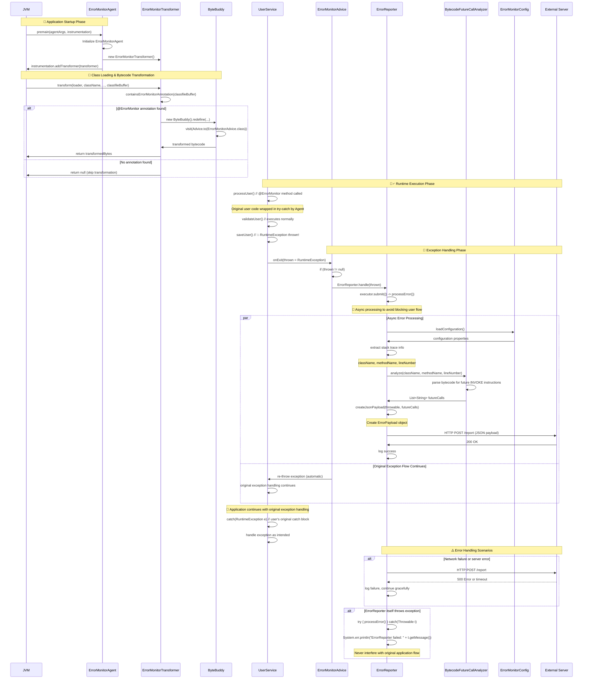

### 시퀀스 다이어그램

- 시퀀스 다이어그램 주요 흐름
    1. **🚀 Startup Phase**: Agent 초기화 및 Transformer 등록
    2. **🔧 Transformation Phase**: 클래스 로딩 시 바이트코드 변환 (성능 최적화 포함)
    3. **🏃‍♂️ Runtime Phase**: 실제 사용자 코드 실행
    4. **🚨 Exception Handling**: 예외 발생 시 자동 감지 및 비동기 처리
    5. **🔄 Graceful Continue**: 원본 애플리케이션 흐름은 방해받지 않음